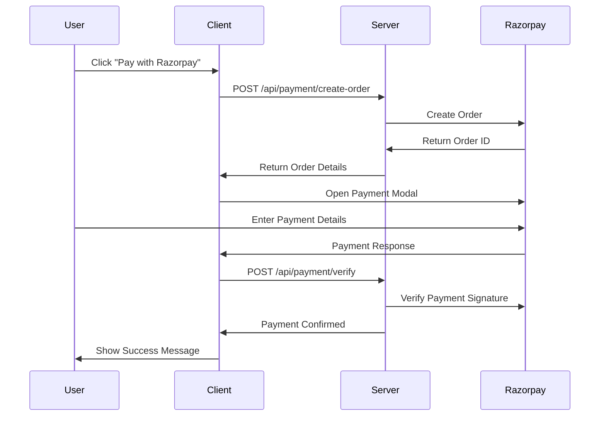

# Payments Integration Update

Razorpay integration has been removed. The application now uses Cashfree Hosted Checkout.

Refer to `ENVIRONMENT_VARIABLES.md` for required keys and see server `cashfree-service.ts` and route `/api/payment/create-order` for the new flow. Client utilities are in `client/src/lib/cashfree.ts` and the referral page uses Cashfree.

## Prerequisites

1. A Razorpay account (sign up at https://razorpay.com)
2. Node.js and npm installed
3. The Job Thrive application running locally

## Setup Steps

### 1. Get Razorpay Credentials

1. Log in to your Razorpay Dashboard
2. Go to Settings → API Keys
3. Generate API Keys for Test Mode
4. Note down:
   - **Key ID** (starts with `rzp_test_`)
   - **Key Secret** (keep this secure)

### 2. Configure Environment Variables

#### Server Environment (server/.env)
```bash
# Add these to your server/.env file
RAZORPAY_KEY_ID=rzp_test_yKGm7Ksh8Lktfg
RAZORPAY_KEY_SECRET=WytFVBQFVfCgORKOK3tYZXZI
```

#### Client Environment (client/.env)
```bash
# Add this to your client/.env file
VITE_RAZORPAY_KEY_ID=rzp_test_yKGm7Ksh8Lktfg
```

⚠️ **Security Note**: Never expose your Key Secret on the client side!

### 3. Dependencies

The required dependencies have been installed:
```bash
npm install razorpay crypto multer @types/multer
```

## How the Integration Works

### 1. Payment Flow



### 2. Key Components

#### Server-Side (`server/razorpay-service.ts`)
- **Order Creation**: Creates secure payment orders
- **Signature Verification**: Validates payment authenticity

#### Client-Side (`client/src/lib/razorpay.ts`)
- **Script Loading**: Dynamically loads Razorpay checkout
- **Payment Modal**: Opens secure payment interface
- **Error Handling**: Manages payment failures

#### API Endpoints
- `POST /api/payment/create-order` - Creates Razorpay order
- `POST /api/payment/verify` - Verifies payment completion

### 3. Security Features

✅ **Payment Signature Verification**: All payments are cryptographically verified
✅ **Server-Side Validation**: Amount and job details validated on backend
✅ **Secure Credential Storage**: Secrets stored server-side only
✅ **HTTPS Required**: Payment processing requires secure connections

## Testing

### Test Mode
- Use test credentials (starting with `rzp_test_`)
- Test card numbers: 4111 1111 1111 1111
- Any CVV and future expiry date
- Payments won't be actually charged

### Production Mode
1. Switch to Live API keys in Razorpay dashboard
2. Update environment variables with live credentials
3. Ensure HTTPS is enabled on your domain

## Error Handling

The integration includes comprehensive error handling for:
- Network failures
- Invalid payment signatures
- Razorpay service downtime
- User payment cancellations

## Monitoring

### Payment Logs
- All payment activities are logged to console
- Success/failure events are tracked

### Razorpay Dashboard
- Real-time payment monitoring
- Transaction history
- Refund management
- Analytics and reports

## Troubleshooting

### Common Issues

1. **"Payment system is not available"**
   - Check if Razorpay script loads properly
   - Verify internet connection
   - Check browser console for errors

2. **"Invalid payment signature"**
   - Verify Key Secret is correct in server environment

3. **"Amount mismatch"**
   - Ensure job referral fee calculation is consistent
   - Check for floating point precision issues

4. **Payment modal doesn't open**
   - Verify Key ID is correctly set in client environment
   - Check if Razorpay script loaded successfully

### Development Tips

1. Use browser developer tools to debug client-side issues
2. Check server logs for backend payment processing
3. Use Razorpay's test mode for development

## File Structure

```
server/
├── razorpay-service.ts     # Payment service logic
├── routes.ts              # Payment API endpoints
└── .env                   # Server environment variables

client/
├── src/lib/razorpay.ts           # Client payment utilities
├── src/pages/referral-request.tsx # Payment UI
└── .env                          # Client environment variables
```

## Support

For issues specific to this integration, check:
1. Application logs (server console)
2. Browser developer console
3. Razorpay dashboard for payment status

For Razorpay-specific issues:
- [Razorpay Documentation](https://razorpay.com/docs/)
- [Razorpay Support](https://razorpay.com/support/)

---

**Ready to Test**: Your Razorpay integration is now ready! Start your server and test payments with the test card number above. 